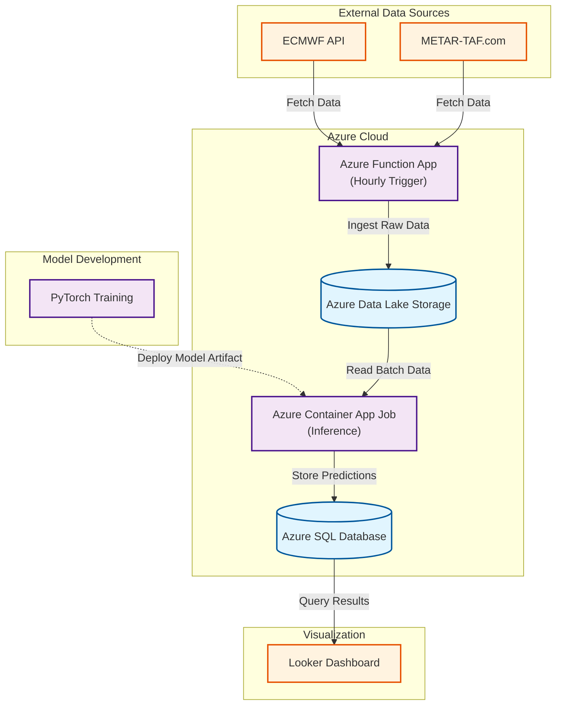

## Introduction

Landing conditions at Rankin Inlet (CYRT) are often unpredictable especially in the winter. When I wa working at Meliadine Gold Mine 25km away from Rankin Inlet we would be flown from Montreal to Rankin Inlet. Flights will be often delayed or postponed due to weather conditions. I had the idea to create a model to better predict if there would be safe landing conditions for when the plane arrived so less flights will need to be delayed or postponed. 

The model aims to predict if the landing conditions at Rankin Inlet will be favourable for landing 6 hours in advance. 6 hours is the approximate flight time from Montreal to Rankin Inlet. That way we can predict if a plane takes off now if the weather conditions will allow for a safe landing. 

## The Data
The European Centre for Medium-Range Weather Forecasts (ECMWF) provides historical gridded 2D weather data in GRIB format, with each grid cell representing a point estimate of weather conditions. For this project, I used: 

 t2m → 2 metre temperature 
 u10 → 10 metre U-component of wind 
 v10 → 10 metre V-component of wind 
 msl → Mean sea level pressure 

 ECMWF also provides current weather conditions, which I used to generate real-time predictions. 

 Additionally, metar-taf.com supplied historical METAR data, which I used to determine whether it was safe for a plane to land. This binary outcome served as the model’s response variable.

## The Model
Predictions were generated using a 2D convolutional neural network with four input channels, each representing a different weather variable. 

The model was trained on hourly data from 2022, validated on 2023 data, and tested on 2024 data. It achieved an AUC of 0.87 on the test set.

## Architecture

### Data Sources
| ECMWF API | METAR-TAF.com |
|:---------:|:-------------:|
|  |  |

### Azure Cloud Architecture
| Azure Functions | Azure Data Lake Storage | Container App Jobs | Azure SQL |
|:---------------:|:-----------------------:|:------------------:|:---------:|
|  |  |  |  |
| Hourly Trigger | Raw Data Storage | Model Inference | Predictions Storage |

### Model Development
| PyTorch |
|:-------:|
|  |

### Visualization
| Looker Dashboard |
|:----------------:|
|  |

### Data Flow

To deploy use command: docker buildx build --platform linux/amd64 -t willseff/cyrt-inference:1.4 --push .
